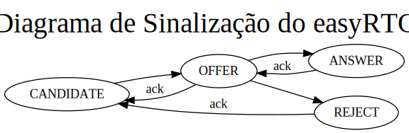
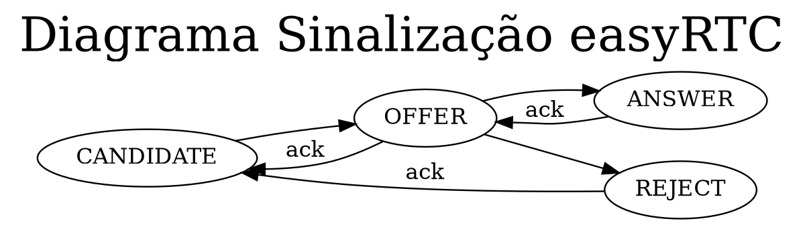

## Sistemas de Multimídia
### Engenharia de Telecomunicações
> Repositório destinado para o projeto final da disciplina de SMU29009

#### Cenário geral

Há um servidor WebRTC cuja função é estabelecer conferência entre duas ou mais partes através de uma seção pré estabelecida.
O princípio de execução desde projeto foi baseado na implementação realizada pelo EasyRTC. Os tipos de mídia oferecidas nessa aplicação são:
* Áudio;
* Vídeo;
##### **Cenário de análise**

#### Partes envolvidas:
**Usuário 1**: Desktop com acesso a internet **IP**:191.36.15.45

**Usuário 2**: Celular utilizando WIFI **IP**: 191.36.10.22

**Navegador utilizado**: Google Chrome

#### Conteúdo de análise:

Será analisado neste cenário, uma comunicação multimídia entre **usuário 1** e **usuário 2**.  

#### Sinalização do WebRTC

| Data |
|---|
| → 2probe | 
| ← 3probe | 
| → 421["easyrtcCmd",{"msgType":"stillAlive","msgData":{}}] | 
| ← 431[{"msgType":"ack"}] |
| → 422["easyrtcCmd",{"msgType":"setRoomApiField","msgData":{"setRoomApiField":{"roomName":"default","field":{"mediaIds":{"fieldName":"mediaIds","fieldValue":{}}}}}}] |
| ← 432[{"msgType":"roomData","msgData":{"roomData":{"default":{"roomName":"default","roomStatus":"update","clientListDelta":{"updateClient":{"TxA1sCpvXBsJNJ3J":{"easyrtcid":"TxA1sCpvXBsJNJ3J","roomJoinTime":1574791029318,"presence":{"show":"chat","status":null},"apiField":{"mediaIds":{"fieldName":"mediaIds","fieldValue":{}}}}}}}}}}] |
| → 423["easyrtcCmd",{"msgType":"stillAlive","msgData":{}}] |
| ← 433[{"msgType":"ack"}] |
| → 2 |
| ← 3 |
| → 424["easyrtcCmd",{"msgType":"stillAlive","msgData":{}}] |
| ← 434[{"msgType":"ack"}] |
| → 2 |
| ← 3 |
| ··· |


Analisando a sequência de mensagens acima, verifica-se que, primeiramente, uma das partes faz um teste a fim de verificar a presença da outra, requisitando uma mensgem ("msgType") "stillAlive". Em seguida, o cliente responde com o "msgType" "ack", confirmando que está presente. 
Confirmada a presença, outra mensagem "msgType" é enviada, desta vez contendo o atributo "setRoomApiField". É requisitado com o campo "msgData". Este, solicita os dados especificados em seguida: "setRoomApiField", contendo "roomName" do tipo "default". 
Outro campo ("field") é especificado "mediaIds" contendo os campos "fieldName" com atributo "mediaIds" e "fieldValue". O atributo "mediaIds" retorna a identificação das mídias trocadas para início da troca das mesmas. O campo "easyrtcid" traz  a identificação da sessão.
Após o estabelecimento, ocorrem, repetidamente em curtos intervalos, testes de presença.

O parâmetro **easyrtcCmd** é utilizado pelo socket.io para enviar e receber os comandos de sinalização. 
Do lado do servidor, a menos que seja especificado, as mensagens enviadas retornarão com **ack** ou mensagem de **error**.
Há o **msgType**, que são os tipos de mensagens enviadas entre os clientes e que contém os parâmetros requisitados por cada cliente.
Há também o **msgData**, que contém as informações solicitadas pelo **msgType**.

Inicialmente, temos o *msgType* do tipo **candidate**. É uma sinalização do WebRTC. Ele envia os canditatos de ICE para o estabelecimento da conexão. Tanto a origem, quanto o destino, devem estar *online*, autenticados e na mesma sessão. Os campos deste tipo de mensagem são: *targetEasyrtcid* (exigido, pois é a identificação da sessão), e *msgData* (exigido pois é o contéudo da resposta da mensagem).

Para iniciar o estabelecimento da conexão, utiliza-se o *msgType* *offer*, que contém os campos: *targetEasyrtcid*, que é o identificador único do destino e o *msgData* que contém o SDP do usuário que iniciou a comunicação. Caso tudo ocorra bem, é recebido um *ack* do destino. 
Em seguida, após o sucesso do passo anterior, é recebido um *msgType* *answer*, que contém o os campos: *targetEasyrtcid*, que é o identificador único do destino e o *msgData* que contém o SDP do usuário alvo da comunicação. Caso tudo ocorra bem, é recebido um *ack* do destino.

Neste ponto, ambas as partes sabem da capacidade uma da outra em relação aos codecs de áudio e vídeo.

Abaixo segue o diagrama ilustrando todo o processo descrito acima:



Digrama gerado através da linguagem DOT, segue abaxo o código:


| 421                                                                                                                                                                                                                                                                                                                                       | 431                                                                                                                                                                                                                                                                                                                                                                                                                                                                                                                                                                                                                                                                                                                                                                                                                                        |
|-------------------------------------------------------------------------------------------------------------------------------------------------------------------------------------------------------------------------------------------------------------------------------------------------------------------------------------------|--------------------------------------------------------------------------------------------------------------------------------------------------------------------------------------------------------------------------------------------------------------------------------------------------------------------------------------------------------------------------------------------------------------------------------------------------------------------------------------------------------------------------------------------------------------------------------------------------------------------------------------------------------------------------------------------------------------------------------------------------------------------------------------------------------------------------------------------|
| [<br>  "easyrtcCmd",<br>  {<br>    "msgType": "stillAlive",<br>    "msgData": {}<br>  }<br>]                                                                                                                                                                                                                                              | [<br>  {<br>    "msgType": "ack"<br>  }<br>]                                                                                                                                                                                                                                                                                                                                                                                                                                                                                                                                                                                                                                                                                                                                                                                               |
| 422                                                                                                                                                                                                                                                                                                                                       | 432                                                                                                                                                                                                                                                                                                                                                                                                                                                                                                                                                                                                                                                                                                                                                                                                                                        |
| [<br>  "easyrtcCmd",<br>  {<br>    "msgType": "setRoomApiField",<br>    "msgData": {<br>      "<tab> setRoomApiField": {<br>        "roomName": "default",<br>        "field": {<br>          "mediaIds": {<br>            "fieldName": "mediaIds",<br>            "fieldValue": {}<br>          }<br>        }<br>      }<br>    }<br>  }<br>] | [<br>  {<br>    "msgType": "roomData",<br>    "msgData": {<br>      "roomData": {<br>        "default": {<br>          "roomName": "default",<br>          "roomStatus": "update",<br>          "clientListDelta": {<br>            "updateClient": {<br>              "TxA1sCpvXBsJNJ3J": {<br>                "easyrtcid": "TxA1sCpvXBsJNJ3J",<br>                "roomJoinTime": 1574791029318,<br>                "presence": {<br>                  "show": "chat",<br>                  "status": null<br>                },<br>                "apiField": {<br>                  "mediaIds": {<br>                    "fieldName": "mediaIds",<br>                    "fieldValue": {}<br>                  }<br>                }<br>              }<br>            }<br>          }<br>        }<br>      }<br>    }<br>  }<br>] |
         

Na tabela acima esta destacada a etapa do estabelecimento da conexão entre as partes.

#### Cabeçalhos do WebRTC 

##### Requisição

```
GEThttps://ifsc.ga/socket.io/?EIO=3&transport=websocket&sid=4LwWoaLpG7VuhSGcAAAt
[HTTP/1.1 101 Switching Protocols 11ms]

Request URL:https://ifsc.ga/socket.io/?EIO=3&transport=websocket&sid=4LwWoaLpG7VuhSGcAAAt
Request method:GET
Remote address:191.36.8.34:443
Status code:
101
Version:HTTP/1.1
```
##### Resposta
```
Response headers (234 B)	
Raw headers
HTTP/1.1 101 Switching Protocols
Server: nginx/1.17.4
Date: Mon, 04 Nov 2019 18:41:01 GMT
Connection: upgrade
Upgrade: websocket
Sec-WebSocket-Accept: q4+f69RRQf+ghhG3MRga1anbxZ8=
Sec-WebSocket-Extensions: permessage-deflate
Request headers (530 B)	
Raw headers
Host: ifsc.ga
User-Agent: Mozilla/5.0 (X11; Linux x86_64; rv:68.0) Gecko/20100101 Firefox/68.0
Accept: */*
Accept-Language: en-US,en;q=0.5
Accept-Encoding: gzip, deflate, br
Sec-WebSocket-Version: 13
Origin: https://ifsc.ga
Sec-WebSocket-Extensions: permessage-deflate
Sec-WebSocket-Key: DGN9/tSYn5fteJkcq/SiNA==
Connection: keep-alive, Upgrade
Cookie: io=4LwWoaLpG7VuhSGcAAAt
Pragma: no-cache
Cache-Control: no-cache
Upgrade: websocket
```

#### Análise no navegador
##### SDP (Protocolo de Descrição da Sessão) local (Resposta)
```
v=0
o=mozilla...THIS_IS_SDPARTA-70.0.1 3664883122906395129 0 IN IP4 0.0.0.0
s=-
t=0 0
a=sendrecv
a=fingerprint:sha-256 B9:4E:C2:7D:55:8A:2C:77:F6:99:42:36:D4:2D:5A:FE:7D:14:85:3A:5A:DE:75:1E:62:05:2A:2F:74:A3:FB:F8
a=group:BUNDLE 0
a=ice-options:trickle
a=msid-semantic:WMS *
m=audio 34052 UDP/TLS/RTP/SAVPF 111 9 0 8 126
c=IN IP4 191.36.15.105
a=candidate:0 1 UDP 2122252543 10.10.10.113 34052 typ host
a=candidate:6 1 UDP 2122187007 191.36.15.49 41321 typ host
a=candidate:12 1 TCP 2105524479 10.10.10.113 9 typ host tcptype active
a=candidate:13 1 TCP 2105458943 191.36.15.49 9 typ host tcptype active
a=candidate:1 1 UDP 1686052863 191.36.15.105 34052 typ srflx raddr 10.10.10.113 rport 34052
a=sendrecv
a=extmap:1 urn:ietf:params:rtp-hdrext:ssrc-audio-level
a=extmap:4 urn:ietf:params:rtp-hdrext:sdes:mid
a=fmtp:111 maxplaybackrate=48000;stereo=1;useinbandfec=1
a=fmtp:126 0-15
a=ice-pwd:a5a454dada29a282e703fa64f2895f8d
a=ice-ufrag:78d6ce02
a=mid:0
a=msid:{f504e355-1df2-4715-add4-86a379b6bc43} {20c6777e-2898-4aec-b399-45d7bf29c8c8}
a=rtcp-mux
a=rtpmap:111 opus/48000/2
a=rtpmap:9 G722/8000/1
a=rtpmap:0 PCMU/8000
a=rtpmap:8 PCMA/8000
a=rtpmap:126 telephone-event/8000
a=setup:active
a=ssrc:3248660371 cname:{78aac3a2-fbc3-48f0-99b0-80d641a054f2}

```
##### Codec ofertados na resposta

 - opus à 48000 Hz, com 2 canais
 - ISAC à 16000 Hz, com 1 canal
 - G722/à 8000 Hz, com 1 canal
 - PCMU à 8000 Hz
 - PCMA à 8000 Hz

##### SDP (Protocolo de Descrição da Sessão) Remoto (Oferta)
```
v=0
o=- 8894621801134890394 2 IN IP4 127.0.0.1
s=-
t=0 0
a=sendrecv
a=group:BUNDLE 0
a=msid-semantic:WMS  {
    "msgType": "ack"
  }
] SW1LDGJjg94uffeKZLWXxB1NR01hwDH5vZ8M
m=audio 9 UDP/TLS/RTP/SAVPF 111 103 9 0 8 105 13 110 113 126
c=IN IP4 0.0.0.0
a=sendrecv
a=extmap:1 urn:ietf:params:rtp-hdrext:ssrc-audio-level
a=extmap:2 http://www.webrtc.org/experiments/rtp-hdrext/abs-send-time
a=extmap:3 http://www.ietf.org/id/draft-holmer-rmcat-transport-wide-cc-extensions-01
a=extmap:4 urn:ietf:params:rtp-hdrext:sdes:mid
a=extmap:5 urn:ietf:params:rtp-hdrext:sdes:rtp-stream-id
a=extmap:6 urn:ietf:params:rtp-hdrext:sdes:repaired-rtp-stream-id
a=fingerprint:sha-256 B7:54:00:AA:6D:BC:63:97:91:82:77:A4:C0:4C:4A:16:0B:D2:19:5C:80:C5:B7:27:49:77:5C:C1:24:26:3A:3C
a=fmtp:111 maxplaybackrate=0;stereo=0;useinbandfec=1
a=ice-options:trickle
a=ice-pwd:15t33GicN6Qpn+vnO1G5UhLg
a=ice-ufrag:RB9e
a=mid:0
a=msid:SW1LDGJjg94uffeKZLWXxB1NR01hwDH5vZ8M e6222780-8083-4796-8695-08dcfe31308b
a=rtcp:9 IN IP4 0.0.0.0
a=rtcp-mux
a=rtpmap:111 opus/48000/2
a=rtpmap:103 ISAC/16000/1
a=rtpmap:9 G722/8000/1
a=rtpmap:0 PCMU/8000
a=rtpmap:8 PCMA/8000
a=rtpmap:105 CN/16000/1
a=rtpmap:13 CN/8000/1
a=rtpmap:110 telephone-event/48000
a=rtpmap:113 telephone-event/16000
a=rtpmap:126 telephone-event/8000
a=setup:actpass
a=ssrc:509559268 cname:7ODgOUg2dlVM7YZM
a=ssrc:509559268 msid:SW1LDGJjg94uffeKZLWXxB1NR01hwDH5vZ8M e6222780-8083-4796-8695-08dcfe31308b
a=ssrc:509559268 mslabel:SW1LDGJjg94uffeKZLWXxB1NR01hwDH5vZ8M
a=ssrc:509559268 label:e6222780-8083-4796-8695-08dcfe31308b
```

##### Codec ofertados na Oferta

 - opus à 48000 Hz, com 2 canais
 - ISAC à 16000 Hz, com 1 canal
 - G722/à 8000 Hz, com 1 canal
 - PCMU à 8000 Hz
 - PCMA à 8000 Hz


#### Exemplo de comunicação observado através do about:config do Firefox

|Candidato local |	Candidato remoto |	ID do componente |	Estado ICE |	Prioridade |	Nomeado |	Selecionado |	Bytes enviados |	Bytes recebidos |
|---|---|---|---|---|---|---|---|---|
|191.36.15.49:51149/udp(host) [non-proxied] |	191.36.10.110:41725/udp(host) |	1	|succeeded |	9114723795305512000 |	true |	true |	84102 |	195032 |
|10.10.10.113:37057/udp(host) [non-proxied] |	191.36.10.110:41725/udp(host) |	1 |	failed |	9114756780654461000 |	false |	false |	0 |	0 |
|(redacted):37057/udp(prflx) [non-proxied] |	191.36.10.110:41725/udp(host) |	1	| succeeded |	7962083765675376000 |	false |	false |	0 |	0 |
